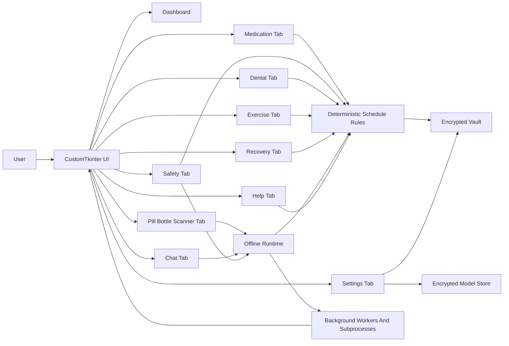
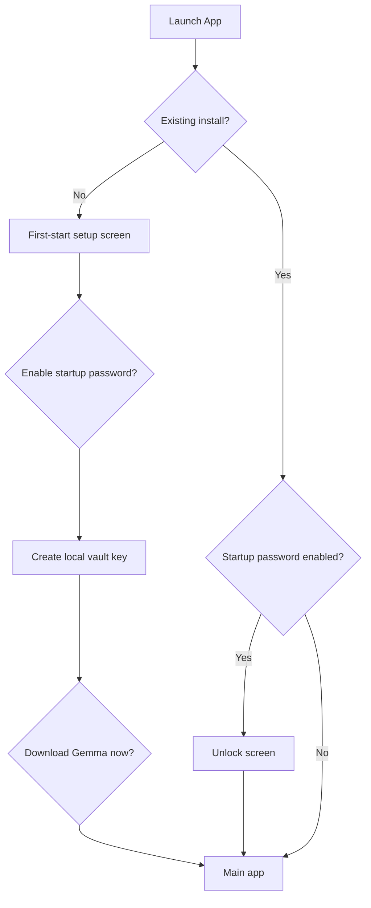
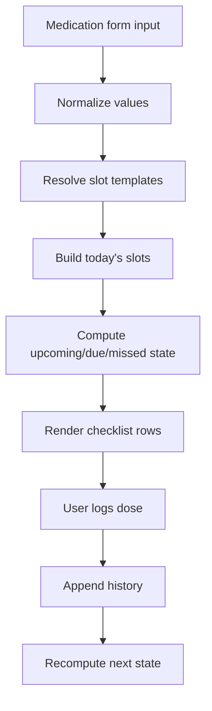
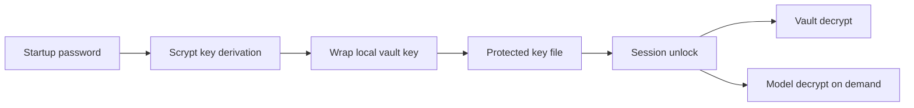

# Health Dash Desktop

Health Dash Desktop is a local-first health workflow application for medication timing, bottle-photo review, dental routines, recovery journaling, gentle movement reminders, and offline model-assisted context review. The project is intentionally designed as a private desktop workspace rather than a cloud-first health dashboard. Its central idea is simple: sensitive day-to-day health logistics are often better managed in a tool that stays inspectable, editable, and local.

This README is intentionally long. It is both a practical operating manual and an extended technical paper for the project. It is written for users, maintainers, reviewers, and curious builders who want the full story rather than a minimal landing page.

## Visual Overview

## Demo Screenshots


## Table Of Contents

1. [Executive Summary](#executive-summary)
2. [Why This Project Exists](#why-this-project-exists)
3. [Core Principles](#core-principles)
4. [What The App Does](#what-the-app-does)
5. [Feature Inventory](#feature-inventory)
6. [Advanced Feature Map](#advanced-feature-map)
7. [Screens, Tabs, And Workflow Philosophy](#screens-tabs-and-workflow-philosophy)
8. [Architecture](#architecture)
9. [System Diagrams](#system-diagrams)
10. [Platform Support](#platform-support)
11. [Quick Start](#quick-start)
12. [Installation Guides](#installation-guides)
13. [First-Start Flow](#first-start-flow)
14. [User Guide](#user-guide)
15. [Medication Scheduling Model](#medication-scheduling-model)
16. [Medication Safety Workflow](#medication-safety-workflow)
17. [Bottle Photo Import](#bottle-photo-import)
18. [Dental Workflow](#dental-workflow)
19. [Exercise And Walking Reminder System](#exercise-and-walking-reminder-system)
20. [Chat Workflow](#chat-workflow)
21. [Settings And Runtime Controls](#settings-and-runtime-controls)
22. [Security Model](#security-model)
23. [Data Layout](#data-layout)
24. [Dependency Locking](#dependency-locking)
25. [Development Notes](#development-notes)
26. [Troubleshooting](#troubleshooting)
27. [FAQ](#faq)
28. [Science Monograph](#science-monograph)
29. [Appendix A: Mathematical Symbols](#appendix-a-mathematical-symbols)
30. [Appendix B: Example Vault Shapes](#appendix-b-example-vault-shapes)
31. [Appendix C: File And Folder Map](#appendix-c-file-and-folder-map)
32. [Appendix D: Operational Checklists](#appendix-d-operational-checklists)
33. [Safety Note](#safety-note)

## Executive Summary

Health Dash Desktop is a desktop application built with `customtkinter` and a local encrypted vault. It is designed to help users manage everyday health-related routines without requiring their personal workflow data to leave the machine by default.

At a high level, the application provides:

- A medication planner with named dose times, interval logic, rolling 24-hour totals, max-per-day tracking, and date-aware checklist review.
- A Care Compass dashboard that combines meds, regimen safety, routines, privacy state, and the best next workflow action.
- Focused per-medication safety checks plus all-medication integration scans with deterministic fallback.
- Bottle-photo support for medication import and review, including native image input when the local runtime supports it.
- Dental hygiene reminders for brushing, flossing, and rinsing, plus dental photo review and recovery notes.
- A recovery support studio with clean-day tracking, points, milestones, mood/craving check-ins, resets, reminders, and a coping plan.
- Exercise reminders for walking, light exercise, and stretching with daily minute goals.
- A local Gemma assistant with General, Therapy, and Recovery Coach modes, quick prompts, context preview, markdown rendering, and non-blocking subprocess inference.
- A Help and Flow Guide with an A-K workflow path, feature help, and a best-path simulation.
- A command palette for fast navigation and cross-workflow actions.
- Startup password protection, local vault key rotation, text-size controls, checklist undo policy, backend selection, and model sealing controls.

The app is not intended to diagnose disease, prescribe treatment, or replace instructions from a clinician, pharmacist, or dentist. It is a local organization and reminder system.

## Why This Project Exists

Health logistics are often hard for reasons that have very little to do with raw medical complexity. The problems are frequently mundane:

- remembering whether a dose was already taken,
- interpreting bottle instructions into real-life times,
- checking whether something is actually late versus merely upcoming,
- tracking daily routines after dental work,
- keeping notes together without sending them into unknown cloud systems,
- staying gently active without needing a full fitness product.

Most software handles only one of these problems at a time. Medication apps often do not understand real-world timing buckets like breakfast or dinner. Task apps can remind, but they do not understand dose intervals or max-per-day boundaries. Notes apps can store text, but they do not offer due-state logic. Fitness trackers can count movement, but they are not designed for “gentle continuity” reminders. Cloud products can do many things, but privacy and inspectability are often secondary.

Health Dash Desktop exists because there is room for a different kind of tool:

- not a hospital system,
- not a social health network,
- not a diagnosis engine,
- not a purely timer-driven alert box,
- but a personal local health workflow workbench.

## Core Principles

The project is built around a small set of principles.

### 1. Local First

The vault, model cache, settings, and routine state are designed to live on the user’s computer. Local-first does not automatically mean perfect security, but it creates a clearer trust boundary and gives the user more direct control.

### 2. Deterministic Scheduling Before Generative Advice

The application may use an offline model to parse, summarize, or contextualize user-provided information, but critical reminder timing and dose-state logic are rule-based and inspectable. This means users can understand why something is marked due, missed, or upcoming.

### 3. Human-Readable States

The app uses words like `Scheduled`, `Due`, `Missed`, `Active`, `Ready`, and `Gentle Nudge` instead of trying to sound clinical. The goal is clarity without false authority.

### 4. Soft Guidance Over Alarmism

The application should reduce cognitive load, not amplify stress. Warnings matter, but constant red-state noise weakens trust. The UI therefore tries to distinguish between caution, true schedule risk, and normal upcoming reminders.

### 5. Inspectable Security

Encryption is more meaningful when users can see how it affects daily use. That is why the app includes a first-start security flow, a startup-password option, and a visible settings area for model and security controls.

### 6. Desktop Practicality

This project assumes that many users want to review a day, a checklist, or a routine plan at a real screen size. That makes the desktop form factor useful, especially when reading bottle details or comparing scheduled times.

## What The App Does

Health Dash Desktop currently combines several operational domains in one workflow surface.

### Medication Management

- Store medication name, dose amount, interval, max daily amount, bottle directions, notes, first dose anchor, and optional custom daily times.
- Build daily slots such as `Breakfast`, `Lunch`, `Dinner`, and `Nighttime`.
- Show due-now, upcoming, and missed state based on the computer clock.
- Provide a date-aware daily checklist with explicit row state, dose logging, missed-slot reconciliation, and optional undo.
- Track active medications and completed/archived medication history without forcing the user to reconstruct the day mentally.
- Run focused per-medication safety checks and keep a saved safety review in the encrypted vault.
- Integrate all active medications into a regimen-level safety scan after changes or on demand.

### Bottle Review

- Accept local images of medication bottles or packaging.
- Feed image context into the local workflow so imported content can seed schedule data.
- Preserve a review summary in the encrypted vault.

### Dental Hygiene

- Track brushing, flossing, and rinsing cadence.
- Save hygiene intervals locally.
- Support photo-based hygiene review workflows with local risk summaries and trend text.

### Dental Recovery

- Save procedure type and date.
- Maintain recovery notes and check-in images.
- Preserve local review summaries and trend context.

### Recovery Support

- Save a recovery focus, clean-since date, motivation, coping plan, and reminder time.
- Track clean days, points, next milestones, mood, craving level, and recent recovery history.
- Log daily check-ins or relapse/restart events without losing the larger recovery timeline.
- Feed recovery context into the local assistant's Recovery Coach mode.

### Exercise

- Provide gentle reminder rhythm for walking.
- Provide gentle reminder rhythm for light exercise.
- Provide gentle reminder rhythm for stretching.
- Track daily minute goals and recently logged sessions.

### Local Chat Assistant

- Offer an optional local assistant context window that can summarize user-entered workflow state and discuss schedule context.
- Switch between General, Therapy, and Recovery Coach modes.
- Use quick prompts such as Summarize Today, What Next, Check Safety, and Draft Questions.
- Preview what vault facts and local context metadata the assistant will emphasize before sending.
- Run assistant generation in a spawned worker process so the desktop UI stays responsive while Gemma thinks.

### Settings And Runtime

- Download and seal the model locally.
- Verify model integrity.
- Cycle inference backend preference across Auto, CPU, and GPU.
- Toggle native image input support.
- Add or remove startup-password protection.
- Rotate the local vault key.
- Change text size.
- Control whether checklist rows can be unchecked.
- Delete the plain model cache after sealing.

## Feature Inventory

| Area | Capability | Current intent |
| --- | --- | --- |
| Dashboard | Care Compass | Pick a best next action across medication, routines, safety, and privacy state |
| Dashboard | Dose Safety card | Show focused dose-safety status and the latest explanatory message |
| Dashboard | All-Meds Integration | Surface regimen-level safety state beside per-medication checks |
| Dashboard | Timeline and checklist | Reconstruct the day with due, missed, upcoming, and taken rows |
| Dashboard | Date-aware checklist | Review earlier or future checklist dates using Prev, Today, Next, and Go |
| Dashboard | Dashboard focus picker | Inspect active medications and completed medication history from one place |
| Dashboard | Gentle Nudge and flow snapshot | Keep a short next-step summary and best-path hint visible |
| Medications | Interval schedule logic | Keep dose timing deterministic |
| Medications | Named daily slots | Map text directions into real life |
| Medications | Custom daily times | Override inferred timing with user-authored slots |
| Medications | Checklist logging | Externalize memory into visible rows |
| Medications | Missed-dose reconciliation | Reduce ambiguity around lateness and late logging |
| Medications | Complete / Archive | Remove a medication from the current regimen while preserving dose history |
| Safety | Focused safety check | Review one selected medication with local model support and stored-rule fallback |
| Safety | All-meds safety scan | Integrate active regimen context after medication changes or manual scans |
| Safety | Deterministic fallback | Preserve useful safety summaries even when the model is missing or unavailable |
| Pill Bottle Scanner | Bottle-photo import | Seed or review medication context from local image files |
| Pill Bottle Scanner | Native image toggle | Use model-native pixels when supported, or validated image metadata otherwise |
| Dental | Hygiene reminders | Support brush, floss, and rinse continuity |
| Dental | Hygiene photo review | Save local review score, rating, summary, and trend context |
| Dental | Recovery journal | Support post-procedure notes, aftercare context, and photo review |
| Exercise | Walk/light/stretch reminders | Encourage gentle movement continuity |
| Exercise | Daily movement goals | Track minutes logged today against user-set goals |
| Recovery | Recovery support plan | Store motivation, coping plan, reminder time, and clean-since date |
| Recovery | Check-ins and resets | Track daily notes, relapse/restart events, mood, craving, and timeline history |
| Recovery | Points and milestones | Show clean days, points, next milestone, and milestone shelf |
| Chat | Local context response | Support interpretation without cloud-first assumptions |
| Chat | Mode switching | Tune replies for General, Therapy-style, or Recovery Coach support |
| Chat | Context preview | Show prompt health, route, selected facts, and local context metadata before sending |
| Chat | Non-blocking inference | Run Gemma replies in a worker process so the GUI remains responsive |
| Help | A-K flow guide | Explain the intended workflow from Dashboard through Settings |
| Help | Best-path simulation | Suggest a next workflow hop from current app state |
| Commands | Command palette | Jump to common workflows with `Ctrl+K` |
| Settings | Model runtime controls | Keep offline runtime visible and manageable |
| Settings | Backend selection | Choose Auto, CPU, or GPU with automatic fallback where possible |
| Settings | Startup password | Add a second barrier for vault unlock |
| Settings | Key rotation | Refresh local encryption material and reseal protected files |
| Settings | Text and checklist settings | Adjust text size and checklist undo policy |

## Advanced Feature Map

This section is the short version of what has grown beyond a basic tracker.

- `Care Compass`: a dashboard decision layer that watches due meds, missed meds, routine due states, password state, and model readiness, then points the user to the next useful tab.
- `Dose Safety`: deterministic medication-schedule checks for intervals, duplicate logs, and rolling 24-hour totals, with optional local model summaries layered on top.
- `All-Meds Safety`: a regimen scan that compares the active medication set and stores the result for Dashboard and Safety tab review.
- `Recovery Support Studio`: clean-day counter, points, milestones, mood/craving sliders, reminder time, daily check-ins, relapse/restart logging, motivation, and coping-plan text.
- `Chat Modes`: General for practical summaries, Therapy for reflective support, and Recovery Coach for recovery-protective next steps.
- `Chat Context Preview`: prompt-health feedback plus selected medication, dental, movement, recovery, safety, and recent chat facts before the model runs.
- `Local Context Metadata`: a quantum-inspired local signal packet derived from vault context and system metrics. It is used only to route and structure assistant/safety prompts, not as clinical evidence.
- `Non-Blocking Model Work`: assistant replies, safety scans, and model tasks run through background workers or spawned subprocesses so long-running inference does not freeze the main window.
- `Command Palette`: `Ctrl+K` opens direct actions for Review Today, Run Safety Scan, Add Medication, Bottle Photo Import, Recovery Check-In, Open Chat, Security Status, and Settings.
- `Help & Flow Guide`: an A-K workflow path and feature guide that explain where to go next when the app feels dense.
- `Security Controls`: first-start setup, unlock screen, startup-password wrapping, add/change/remove password flows, key rotation, encrypted vault, encrypted model sealing, and plain-cache deletion.
- `Usability Controls`: scrollable control-heavy tabs, screen-aware window sizing, text-size scaling, explicit checklist buttons, and optional checklist undo.

## Screens, Tabs, And Workflow Philosophy

The interface is organized into tabs because the tasks are related but not identical. The philosophy is not to hide everything behind one giant dashboard. Instead, the app offers:

- a dashboard for overview,
- dedicated tabs for structured editing,
- a safety tab for regimen review,
- domain-specific tabs for dental and movement,
- a recovery tab for check-ins, milestones, and coping context,
- a chat tab for local summaries and reflection,
- a help tab for flow guidance,
- a settings area for runtime and security controls.

This separation is deliberate. A user should be able to:

- glance at the day,
- switch to a detailed planning area,
- make a change,
- and return to the overview,

without losing track of what changed.

## Architecture

At the broadest level, the system has five interacting layers:

1. Desktop presentation layer.
2. Structured state layer.
3. Deterministic schedule logic layer.
4. Optional local model assistance layer.
5. Encrypted persistence layer.

The presentation layer is responsible for screens, cards, forms, and text visibility. The structured state layer holds medication records, habit reminders, recovery notes, movement logs, and assistant history. The deterministic logic layer computes due states and safety context. The optional model layer contributes parsing and summarization where appropriate. The persistence layer stores encrypted or sealed local data.

The current desktop build also uses a background execution layer for heavier work. Safety scans, assistant replies, model download/sealing, and image-based reviews are launched away from the Tk event loop, and the UI receives results through callbacks or queue polling. This is important because local inference can take long enough that a normal GUI thread would otherwise feel frozen.

## System Diagrams

### High-Level Architecture



### First-Start Flow



### Medication Schedule Data Flow



### Security Flow



## Platform Support

| Platform | Status | Default storage root | Notes |
| --- | --- | --- | --- |
| Ubuntu / Linux | Supported | `${XDG_DATA_HOME:-~/.local/share}/Health Dash` | Best current path for desktop testing |
| Windows | Supported | `%LOCALAPPDATA%\\Health Dash` | Requires Python with Tcl/Tk |
| macOS | Supported | `~/Library/Application Support/Health Dash` | Requires Tk-enabled Python |

## Quick Start

The shortest manual setup path is:

```bash
python3 -m venv venv
source venv/bin/activate
python -m pip install --upgrade pip
pip install -r requirements.txt
python -u main.py
```

If you are on Windows:

```powershell
py -3 -m venv venv
.\venv\Scripts\Activate.ps1
python -m pip install --upgrade pip
pip install -r requirements.txt
python -u main.py
```

## Installation Guides

This section is intentionally detailed so users do not have to infer missing steps.

### Ubuntu / Linux

#### Bootstrap Script

```bash
chmod +x scripts/install-ubuntu.sh
./scripts/install-ubuntu.sh
```

#### Manual Install

```bash
sudo apt update
sudo apt install -y \
    git \
    curl \
    wget \
    nano \
    python3 \
    python3-pip \
    python3-venv \
    python3-tk \
    espeak-ng \
    alsa-utils \
    libespeak1

git clone <your-repo-url> ~/med-safe-desktop
cd ~/med-safe-desktop
python3 -m venv venv
source venv/bin/activate
python -m pip install --upgrade pip
pip install -r requirements.txt
python -u main.py
```

#### Linux Notes

- If `customtkinter` imports but the window does not draw correctly, verify your Tk installation.
- If GPU inference is unavailable, the runtime will still work in CPU mode.
- The app stores data under the local share directory rather than inside the repo itself.

### Windows

#### Prerequisites

1. Install Python 3.11 or newer.
2. Confirm that Python includes Tcl/Tk.
3. Install Git for Windows.
4. Open PowerShell with permission to run a process-local script if needed.

#### Bootstrap Script

```powershell
.\scripts\install-windows.ps1
```

#### Manual Install

```powershell
git clone <your-repo-url> $HOME\med-safe-desktop
cd $HOME\med-safe-desktop
py -3 -m venv venv
.\venv\Scripts\Activate.ps1
python -m pip install --upgrade pip
pip install -r requirements.txt
python -u main.py
```

#### Windows Notes

- Data defaults to `%LOCALAPPDATA%\Health Dash`.
- If the app launches but widgets do not appear correctly, test with a fresh Python installer that explicitly includes Tk.
- The first-start setup screen appears before the main tabs if setup has not been completed yet.

### macOS

#### Prerequisites

1. Install Xcode Command Line Tools with `xcode-select --install`.
2. Install a Tk-enabled Python 3.11+ distribution.
3. Ensure Git is on the path.

#### Bootstrap Script

```bash
chmod +x scripts/install-macos.sh
./scripts/install-macos.sh
```

#### Manual Install

```bash
git clone <your-repo-url> ~/med-safe-desktop
cd ~/med-safe-desktop
python3 -m venv venv
source venv/bin/activate
python -m pip install --upgrade pip
pip install -r requirements.txt
python -u main.py
```

#### macOS Notes

- Data defaults to `~/Library/Application Support/Health Dash`.
- If `tkinter` is unavailable, switch to a Python build that includes Tk support.
- If speech libraries differ across macOS versions, the rest of the app still works.

## First-Start Flow

The first-start flow is one of the most important recent usability changes.

When the application launches on a fresh install, it now opens a setup screen that asks:

- whether to create the secure vault immediately,
- whether to require a startup password in future launches,
- whether to download the local Gemma model during setup.

This matters because it converts hidden initialization steps into visible decisions. The user can see:

- where the local vault will live,
- whether startup unlock is enabled,
- whether the model will occupy local storage immediately.

If the user enables startup-password protection, subsequent launches open at an unlock screen before the main tabs load.

## User Guide

This section walks through the product as an operator would use it.

### The Dashboard

The dashboard is intended to answer the question:

> “What do I need to know right now?”

It is not just a landing page. It is a compressed daily control surface.

The dashboard currently includes:

- a Care Compass card,
- a dose safety card,
- focused and all-meds safety actions,
- today’s due and missed counts,
- a next-due summary,
- a timeline view,
- a focused medication summary,
- a daily checklist,
- a date selector for checklist review,
- recent dose history,
- a dashboard nudge,
- a best-flow snapshot,
- model and password status summary.

Care Compass is the dashboard's routing layer. It watches medication due state, missed doses, routine due counts, safety state, password state, and model readiness. The `Act On Best Step` button sends the user to the tab that most likely needs attention: Dashboard, Dental, Exercise, Recovery, Settings, or Safety.

The checklist is especially important. Each row now includes:

- the scheduled time,
- the medication name,
- the planned dose,
- the slot label,
- the due, taken, future, or missed state,
- and an explicit button for the action available on that row.

This design is intentional. Users should not have to remember which medicine corresponds to which time bucket while scanning the day.

The checklist can also review another date. This makes it useful for checking what happened yesterday, reconciling a missed slot, or previewing the planned slots for a future day. Future checklist rows are visible as planning context but cannot be logged as taken.

### The Medications Tab

The medication form is where structured medication data is authored and edited.

Each medication can include:

- name,
- dose in mg,
- interval in hours,
- max daily amount in mg,
- first planned dose time,
- optional custom daily times,
- bottle directions,
- notes.

The application then uses this structure to generate a daily plan. If custom times are provided, they win. If not, the application tries to infer named slots from text directions. If that also fails, it falls back to interval-derived slots anchored to a first dose time.

The tab also includes:

- a current regimen list,
- completed medication history,
- a saved schedule preview,
- `Complete / Archive` for moving a medication out of the current regimen while keeping history,
- `Run Safety Check` for the selected medication,
- and `Log Dose` for manual dose logging.

### The Safety Tab

The Safety tab is the central place for regimen review. It complements the Dashboard's compact safety cards with a larger view of:

- overall regimen status,
- the last all-meds scan,
- the per-medication safety summaries,
- deterministic fallback results,
- and local model-enhanced scan output when the model is available.

The focused medication safety check reviews one selected medication. The all-meds scan reviews the active regimen as a set. Both are intentionally conservative: deterministic schedule rules provide the baseline, and the local model can summarize but does not silently replace the schedule math.

### The Pill Bottle Scanner Tab

The Pill Bottle Scanner tab is the bottle-photo workspace. It is meant to take local images and preserve the resulting review locally. It is intentionally scrollable so that image review text and import controls remain reachable even on smaller screens.

The workflow validates image files before use. If native model image input is enabled and supported, the runtime can receive the image path directly. If not, Health Dash still attaches validated image metadata so the local prompt can preserve filename, type, size, hash, and security context without pretending to inspect pixels.

### The Dental Tab

The Dental tab combines two related but distinct workflows:

- hygiene maintenance,
- recovery journaling.

The hygiene area tracks routine cadence for brushing, flossing, and rinsing. The recovery area tracks procedure metadata, aftercare notes, and recovery photo review context.

Dental hygiene review can save a score, rating, summary, risk level, and trend context. Dental recovery review can preserve procedure context, symptom notes, aftercare notes, and local review summaries. These features are organizational support, not dental diagnosis.

### The Exercise Tab

The Exercise tab is not a fitness platform. It is a habit-continuity reminder space. It is there to provide gentle support for:

- walking,
- light exercise,
- stretching.

Each movement type has:

- a reminder interval,
- a daily target in minutes,
- a last-completed timestamp,
- a history log,
- a visible due-state card.

The Dashboard also counts due movement routines as part of Care Compass. That means movement does not disappear just because medication state is quiet.

### The Chat Tab

The Chat tab is laid out as a larger conversation workspace with a collapsible context panel. On smaller displays, chat history can get tall quickly, and the input area should remain accessible without requiring fullscreen mode.

The assistant supports three modes:

- `General`: practical schedule and workflow summaries.
- `Therapy`: reflective, emotionally grounded support using the same local vault context.
- `Recovery Coach`: relapse-prevention and recovery-support framing that uses the Recovery tab's clean-day, mood, craving, reminder, and coping-plan context.

The chat tab also includes:

- quick prompt buttons,
- prompt health feedback,
- a local context preview,
- recent chat memory,
- markdown rendering,
- copy buttons for assistant text,
- Enter-to-send and Shift+Enter-for-newline behavior,
- and a disabled send state while a reply is running.

Chat generation runs in a spawned worker process. The main desktop window polls for completion and streams deltas when the local runtime exposes them, so the rest of the UI should remain usable while the model replies.

### The Help Tab

The Help tab explains the app's intended A-K workflow:

1. Dashboard triage.
2. Medication shaping.
3. Checklist reconciliation.
4. Safety review.
5. Bottle-photo import.
6. Dental routines.
7. Movement.
8. Recovery.
9. Chat.
10. Settings.
11. Secure closeout.

It also includes a best-path simulation and feature guide. This is useful when the app has enough features that the next good move is no longer obvious.

### The Settings Tab

The old `Model` label has been renamed to `Settings` because the tab now includes both runtime controls and security controls. It covers:

- model download and verification,
- inference backend preference,
- native image input toggle,
- startup password management,
- key rotation,
- model/plain-cache cleanup,
- text-size scaling,
- startup setup status,
- checklist undo policy,
- and a security status summary.

### The Command Palette

Press `Ctrl+K` to open the command palette. It offers direct jumps and actions for:

- Review Today,
- Run Safety Scan,
- Add Medication,
- Bottle Photo Import,
- Recovery Check-In,
- Open Chat,
- Chat: What Next?,
- Security Status,
- Help & Flow Guide,
- Settings & Security.

## Medication Scheduling Model

This section explains how the current scheduling logic is intended to behave.

### Input Sources

Medication timing can originate from:

1. explicit custom daily slots,
2. inferred slots from bottle directions,
3. interval-derived defaults anchored to a first-dose time.

### Named Slot Examples

Examples of accepted timing concepts include:

- `Breakfast`
- `Daytime`
- `Mid day`
- `Lunch`
- `Dinner`
- `Nighttime`

Examples of custom text:

- `Breakfast 08:00, Lunch 13:00, Dinner 18:00`
- `Breakfast; Mid day; Nighttime`
- `Take with breakfast and dinner`

### Schedule State Types

Each daily slot becomes one of:

- `upcoming`
- `due`
- `taken`
- `missed`

Those states are computed by comparing:

- current wall-clock time,
- scheduled slot timestamp,
- completion history,
- interval-based tolerance windows.

### Why Deterministic Logic Matters

The application intentionally does not let an LLM decide whether a dose is due or whether the last 24-hour total is already too high. That logic should be deterministic, inspectable, and stable.

The model can help with:

- parsing bottle text,
- summarizing context,
- producing a human-readable description,
- comparing notes.

The model should not replace the schedule math.

### Daily Checklist Logic

The daily checklist is generated from today’s slots across saved medications. It sorts rows by scheduled time and displays the medication name alongside the slot label and dose. Logging a row first selects the corresponding medication context, then records the event, then recomputes the dashboard.

The checklist is now date-aware. The date picker can move backward, return to today, move forward, or jump to a typed date. Past and present rows can be reconciled through explicit row actions. Future rows are shown as planning context, not as loggable events.

Checklist undo is controlled from Settings. When enabled, a taken checklist row can be unchecked, which removes the matching recorded dose event for that planned slot. When disabled, completed rows stay locked to reduce accidental history changes.

## Medication Safety Workflow

Medication safety in Health Dash is deliberately layered.

### Deterministic Baseline

The deterministic baseline checks facts the app can compute directly:

- stored dose amount,
- interval hours,
- max daily amount,
- last taken time,
- rolling 24-hour total,
- duplicate-log window,
- due and missed slot state,
- and whether schedule details are missing.

This baseline produces a `Safe`, `Caution`, or `Unsafe` style action before the local model is considered.

### Focused Safety Check

A focused check reviews one selected medication. It is available from Dashboard and Medications. The result is saved so the Dashboard can show the latest selected-med safety message.

### All-Meds Safety Scan

An all-meds scan reviews the active regimen as a set. It is available from Dashboard, Safety, and the command palette. The scan records:

- overall regimen action,
- overall message,
- per-medication summaries,
- pending state while the worker runs,
- and fallback context if the local model is unavailable.

### Local Model Role

The local model may summarize schedule context and help make the review easier to read. It should not invent clinical facts, override stored bottle instructions, or replace professional advice. If the model cannot run, Health Dash falls back to deterministic schedule rules.

## Bottle Photo Import

The bottle workflow is intentionally conservative. It is a local assistance layer, not an OCR certification claim.

The user can:

- choose a bottle photo,
- import from the local computer,
- preserve the resulting summary,
- review imported medication context later.

The main design goal is convenience plus privacy. The workflow should help the user capture real packaging context without forcing manual re-entry of every field when a photo already contains useful information.

## Dental Workflow

The dental features are split because hygiene maintenance and procedure recovery are not the same problem.

### Hygiene

The hygiene system tracks:

- brush interval,
- floss interval,
- rinse interval,
- last completion times,
- optional photo-based review results,
- trend text.

### Recovery

The recovery system tracks:

- procedure type,
- procedure date,
- symptom notes,
- aftercare notes,
- recovery photos,
- daily recovery log summaries.

The point is not to generate medical certainty. The point is to keep routine observations organized and local.

## Exercise And Walking Reminder System

The Exercise tab extends the same local reminder philosophy into movement.

### Why Exercise Belongs Here

The rationale is not that medication, dental routines, and walking are medically identical. The rationale is that they share the same human-factors challenge:

- a routine exists,
- the user wants to keep it,
- life interrupts the rhythm,
- memory alone is unreliable,
- gentle support is more sustainable than alarmism.

### Current Movement Types

- Walk
- Light Exercise
- Stretch

### Current Movement Data Fields

- reminder interval in hours,
- daily goal in minutes,
- last completed timestamp,
- freeform notes,
- local history.

### Why This Is Not A Fitness Tracker

This app does not try to estimate VO2 max, training load, or sports recovery. Its purpose is much narrower and calmer:

- support continuity,
- support light daily movement,
- and give the user a local log that can be reviewed alongside the rest of the day.

## Chat Workflow

The assistant workflow is an optional interpretation layer for the user’s own structured data and local notes. It is most useful when the user wants a readable synthesis of:

- stored medication plans,
- recent reminder state,
- routine continuity,
- recovery support state,
- dental and movement status,
- recent safety summaries,
- or locally saved note context.

The assistant is more useful as a contextual explainer than as a controller.

### Modes

The assistant has three modes:

- `General`: concise, practical help with medication, routine, and workflow summaries.
- `Therapy`: reflective support for making the next step feel emotionally realistic.
- `Recovery Coach`: recovery-specific support that references clean days, points, mood, craving, reminders, milestones, and coping-plan context when relevant.

### Quick Prompts

Quick prompts load common messages into the compose box so the user can edit before sending. The labels adapt by mode. For example, `Summarize Today` becomes more reflective in Therapy mode and more protective in Recovery Coach mode.

### Context Preview

Before a message is sent, the chat tab shows prompt health and a context preview. The preview includes selected facts such as:

- selected medication,
- due and missed medication counts,
- saved safety review state,
- dental routine state,
- movement routine state,
- recovery check-in state,
- recent assistant memory,
- and a local context route.

The local context route is derived from a quantum-inspired signal packet. It is best understood as routing metadata for prompt structure. It is not clinical evidence, not a diagnosis, and not proof of risk.

### Non-Blocking Inference

Chat replies run in a spawned process. The main window sets the chat UI to a pending state, polls a result queue, streams text deltas when available, then restores the compose controls when the reply arrives. This prevents local Gemma inference from locking the entire GUI while it works.

## Settings And Runtime Controls

The Settings tab contains:

- model download and sealing,
- model verification,
- backend cycling,
- native image toggle,
- startup-password management,
- key rotation,
- local security summary,
- text size,
- checklist undo policy,
- model/plain-cache cleanup,
- and startup setup status.

### Runtime Controls

Runtime controls include:

- `Download and Seal` for fetching Gemma and storing it encrypted on disk.
- `Verify SHA` for checking the sealed or plain model against the expected hash.
- `Cycle Backend` for rotating between Auto, CPU, and GPU.
- `Toggle Image Input` for native image input support.
- `Delete Plain Cache` for removing leftover unsealed model cache.
- `Refresh` for re-reading model and security status.

### Security Controls

Security controls include:

- `Require startup password on launch`.
- `Add / Change Password`.
- `Remove Password`.
- `Rotate Vault Key`.

Changing or removing a startup password asks for the current password when the key is already protected. Key rotation reseals the vault and protected model files with fresh key material.

### Accessibility And Workflow Controls

The app also exposes text-size scaling and checklist undo behavior. Text size is useful on dense desktop layouts. Checklist undo is deliberately a setting because some users prefer correction flexibility and others prefer history rows that are harder to alter accidentally.

### Why Rename `Model` To `Settings`

The tab stopped being only about the runtime. Once security controls and startup-password controls were added, `Model` became misleading. `Settings` is a better label because it includes both:

- runtime settings,
- and security settings.

## Security Model

The security model is pragmatic rather than theatrical.

### What Is Encrypted

- the structured vault,
- the sealed model,
- the stored key material when wrapped by a startup password.

The app also keeps temporary model and encryption work files in a local temp area and cleans stale Health Dash temp artifacts on startup.

### What The Startup Password Does

The startup password wraps the local vault key. It does not replace encryption. It creates an additional barrier between local files at rest and an unlocked session.

### Why Chunked Model Encryption Exists

Large model files are not encrypted in one giant monolithic payload because that approach breaks on sufficiently large inputs. Instead, the model sealing flow encrypts the file in chunks and writes a simple file header describing the chunk format.

### Key Rotation

Key rotation generates a fresh vault key, decrypts and re-encrypts the vault with it, and reseals the encrypted model if present. That means rotation is a real state transition, not a cosmetic toggle.

The rotation flow keeps the original vault and key material available until the replacement succeeds. If rotation fails, Health Dash attempts to restore the previous vault/key state and reports the failure rather than silently leaving the user in a half-rotated state.

### Vault Read Protection

If the encrypted vault cannot be read, Health Dash blocks saving instead of replacing unreadable encrypted data with defaults. This is a data-preservation guard: a broken unlock or corrupted read should not quietly overwrite the existing vault.

### Threat Model Scope

This project is not claiming:

- medical-record compliance certification,
- tamper-proof computing,
- hostile-endpoint immunity,
- or clinical-grade evidence controls.

It is claiming a better local privacy posture than an equivalent plaintext or cloud-by-default workflow tool.

## Data Layout

The application uses platform-appropriate storage roots.

### Linux

`${XDG_DATA_HOME:-~/.local/share}/Health Dash`

### Windows

`%LOCALAPPDATA%\Health Dash`

### macOS

`~/Library/Application Support/Health Dash`

### Typical Local Files

- encrypted vault file,
- settings file,
- key file,
- model cache,
- media staging area,
- temporary files.

Temporary files use Health Dash-specific prefixes and stale temp artifacts are cleaned on startup. The app avoids keeping a plain model file after sealing unless an explicit cache remains and the user has not deleted it yet.

## Dependency Locking

This repository includes `requirements.in` and `.github/workflows/lock-requirements.yml`.

The intended workflow is:

- define broad dependency intent in `requirements.in`,
- compile a locked `requirements.txt`,
- use the GitHub workflow to keep the lock fresh,
- review dependency churn explicitly.

### Local Lock Refresh

```bash
python -m pip install --upgrade pip pip-tools
pip-compile --upgrade --resolver=backtracking --output-file requirements.txt requirements.in
```

## Development Notes

This project is in active iteration. The codebase currently emphasizes:

- shipping usable features,
- tightening desktop UX,
- keeping local state shapes clear,
- and preserving compatibility across Linux, Windows, and macOS.

### Current Architectural Pattern

The code is concentrated in `main.py`. This is practical for rapid iteration but eventually should be refactored into modules such as:

- `vault.py`
- `scheduler.py`
- `safety.py`
- `desktop_ui.py`
- `vision.py`
- `dental.py`
- `exercise.py`
- `recovery.py`
- `assistant.py`
- `runtime.py`

Even before that refactor, the current pattern separates long-running tasks from immediate UI events. Model download/sealing uses task callbacks, safety scans use spawned process workers and queues, and assistant replies now use the same subprocess style so local inference cannot monopolize the Tk event loop.

### Testing Direction

The most valuable near-term tests would be:

- medication slot generation tests,
- due/missed-state transition tests,
- max-daily boundary tests,
- duplicate dose guard tests,
- checklist date navigation tests,
- checklist undo tests,
- key-wrap roundtrip tests,
- key-rotation rollback tests,
- chunked model encryption roundtrip tests,
- exercise reminder interval tests.
- recovery milestone and point tests,
- assistant process lifecycle tests,
- all-meds safety fallback tests.

## Troubleshooting

### The window opens too small or some controls still need scrolling

The app now sizes itself relative to the current screen and several tall tabs are scrollable. If a section is still clipped:

- maximize the window once,
- then verify whether the tab itself has an inner scrollbar,
- then report which exact tab and display resolution are involved.

### The Settings tab does not show the model and security controls immediately

The Settings tab is now scrollable and the upper controls were moved higher, but extremely small windows can still require a short scroll because the app deliberately keeps multiple control groups visible in one place.

### The model fails to download or verify

Check:

- network access,
- available disk space,
- whether a partial model artifact already exists,
- whether the local runtime dependencies are installed.

### The app says a startup password is required

That means the local key file is password-wrapped. The correct next step is to unlock it through the startup prompt rather than trying to edit the settings file manually.

### The checklist looks wrong

Re-check:

- dose amount,
- interval,
- max daily amount,
- first dose anchor,
- custom time text,
- bottle directions.

The checklist only reflects the stored structured data.

### The assistant says it is already working

The assistant intentionally allows one active reply at a time. Wait for the pending reply to finish, or clear the chat if you want to cancel the current conversation state. The GUI should remain usable while the worker process runs.

### The assistant returns a worker error

Check:

- whether the Gemma model is downloaded and sealed,
- whether the vault is unlocked,
- whether the selected backend works on the current machine,
- and whether the local runtime dependencies are installed.

If inference fails, the error is added to the chat instead of freezing the app.

### A safety scan falls back to stored schedule rules

That means the local model worker could not complete, but deterministic schedule logic still produced a usable review. Verify model readiness in Settings, then run the scan again if model-supported wording matters.

### Text is too small or dense

Open Settings and change the text size. The app supports Small, Default, Large, and Extra Large scaling.

## FAQ

### Is this a medical device?

No. It is a personal local workflow tool.

### Does the app replace my doctor, dentist, or pharmacist?

No. It helps with organization and review, not clinical authority.

### Can the app work without the offline model?

Yes. Many features are deterministic and local without the runtime.

### Why does the app still show safety results when the model fails?

Because the schedule rules are the baseline. Model output is helpful for summarization, but dose timing, duplicate checks, and 24-hour totals should remain inspectable and available.

### Does Recovery Coach replace therapy, sponsorship, or clinical care?

No. Recovery Coach mode is a local reflection and planning surface. It can help organize next steps and coping-plan context, but it is not professional treatment.

### What does the quantum-inspired context metadata mean?

It is local routing metadata used to structure prompts and summaries. It is not a quantum medical diagnosis, not a validated clinical score, and not evidence by itself.

### Why does the assistant run in a separate process?

Local inference can be slow and some runtimes can hold the Python interpreter long enough to make Tk feel frozen. A worker process keeps the main desktop event loop responsive.

### Why keep the schedule logic deterministic?

Because dose timing and safety boundaries should be inspectable and predictable.

### Why is the README so long?

Because this project is being documented as both software and an applied human-factors design artifact.

## Science Monograph

This section is intentionally long and formal. It is written as an engineering monograph rather than a casual project blurb. It is not peer review, not clinical evidence, and not a substitute for regulatory validation. It is a design-and-systems paper about the project’s architecture and reasoning model.

## Science Monograph Title

**Health Dash Desktop: A Local-First Encrypted Human Factors Workbench For Medication Scheduling, Dental Routine Support, Recovery Journaling, And Gentle Movement Continuity**

## Science Monograph Abstract

Digital reminder tools often optimize for alert delivery while under-optimizing for interpretability, privacy posture, and routine reconstruction. This project explores a different design point: a local desktop application that combines deterministic schedule computation, encrypted persistence, optional offline language-model assistance, and multi-domain daily routine support. The system targets medication timing, bottle-photo interpretation, dental hygiene cadence, dental recovery journaling, and light-movement continuity within a single local-first environment. The central hypothesis is that user trust improves when state transitions are legible, when reminders are contextual rather than purely interruptive, and when sensitive routine data remains within a locally inspectable storage model. The present document frames the application not as a completed medical product, but as an engineering artifact and human-factors experiment in calm, inspectable, privacy-conscious workflow support.

## Plain-Language Monograph Summary

This project asks a very practical question:

> Can a desktop app make routine health logistics easier without hiding the logic, overselling AI, or sending the whole workflow to the cloud?

The answer pursued by Health Dash Desktop is:

- keep the schedule math explicit,
- let the model help where interpretation matters,
- keep the user in control of timing inputs,
- keep the data local,
- and design the interface so the day can be understood at a glance.

## Keywords

- local-first
- health workflow
- desktop interface
- medication schedule logic
- human factors
- encrypted storage
- reminder systems
- routine continuity
- offline model runtime
- personal informatics

## 1. Introduction

Health-related daily routines are deceptively complex. A single dose instruction such as “take every 6 hours, not to exceed 4 tablets in 24 hours” contains multiple interacting constraints:

- a per-ingestion amount,
- a spacing rule,
- a rolling 24-hour maximum,
- and an implicit expectation that the user maps the abstract rule into real life.

The same pattern appears outside medication. Brush, floss, and rinse routines must be repeated with some cadence. Post-procedure recovery involves repeated observation, lightweight note-taking, and periodic reevaluation. Walking and light exercise habits also depend on timing, continuity, and a soft adherence loop. In all of these cases, the user is not necessarily asking for diagnosis. The user is asking for a reliable way to remember, interpret, and continue.

This paper argues that many such workflows benefit from a local-first desktop system that treats schedule logic as a first-class object rather than a hidden implementation detail. The desktop environment is especially useful because it supports:

- broader visual overview,
- richer forms,
- longer note areas,
- clearer cross-routine comparison,
- and stronger sense-making during review.

## 2. Motivation

Existing reminder systems often fail in one or more of the following ways:

- they trigger too early,
- they trigger too often,
- they provide no explanation,
- they treat exact-limit cases as errors,
- they hide the timing assumptions,
- or they distribute routine state across disconnected tools.

A user may know the bottle says “every 6 hours,” yet still wonder:

- “What does that mean for today?”
- “Can I line this up with breakfast and dinner?”
- “Did I already take one recently?”
- “Am I actually late, or is it just within a grace window?”
- “What do I do with all the surrounding notes?”

Health Dash Desktop is motivated by the belief that those questions are workflow questions first and AI questions second.

## 3. Design Objectives

The system design is guided by seven objectives.

### 3.1 Interpretability

Every reminder state should be explainable in terms of stored inputs and simple transformations.

### 3.2 Privacy Posture

Local encrypted persistence should be the default operational model.

### 3.3 Cross-Domain Routine Support

Medication, dental, recovery, and movement workflows should share infrastructure where that improves continuity.

### 3.4 Calm UX

The product should lean toward gentle nudges and readable checklist states rather than constant visual escalation.

### 3.5 Offline Assistive Layer

The local model should help summarize, parse, and contextualize, but not replace deterministic timing and storage logic.

### 3.6 Desktop Legibility

The interface must remain usable on real desktops, including modest screen sizes, without relying on fullscreen.

### 3.7 Explicit Security Transitions

Startup-password enablement, unlock state, and key rotation should be visible user actions, not hidden internals.

## 4. Problem Formalization

We define the daily personal-health workflow problem as follows.

Let there be a set of routines:

$$
\mathcal{R} = \mathcal{M} \cup \mathcal{H} \cup \mathcal{D} \cup \mathcal{E}
$$

where:

- $\mathcal{M}$ is the set of medication routines,
- $\mathcal{H}$ is the set of dental hygiene routines,
- $\mathcal{D}$ is the set of dental recovery observations,
- $\mathcal{E}$ is the set of exercise or movement routines.

Each routine has:

- a configuration state,
- a local history,
- a present-time status,
- and a human-facing rendering.

The task of the application is to compute:

$$
f: (\text{config}, \text{history}, t_{\text{now}}) \rightarrow \text{visible state}
$$

such that the visible state is comprehensible, stable, and useful to the user.

## 5. Notation

For a medication $m$:

- $d_m$ is the dose amount per ingestion in mg.
- $\tau_m$ is the intended interval in hours.
- $L_m$ is the 24-hour maximum amount in mg.
- $S_m = \{s_{m,1}, s_{m,2}, \ldots, s_{m,k}\}$ is the set of planned daily slots.
- $h_m = \{(t_i, a_i)\}$ is the ingestion history.

For a habit $q$ such as walk, stretch, brush, or floss:

- $\tau_q$ is the reminder interval.
- $t_q^{\text{last}}$ is the last completion timestamp.

For movement:

- $g_q$ is the daily goal in minutes.
- $u_q(t)$ is the cumulative minutes logged for the current day by time $t$.

## 6. Medication Scheduling Theory

### 6.1 Daily Slot Set

The system first resolves daily slots for a medication. If custom slots exist, those are used directly. Otherwise the system attempts inference from named time phrases in the directions. If inference fails, it builds interval-based slots from an anchor time.

Formally, the slot resolver is:

$$
S_m =
\begin{cases}
S_m^{\text{custom}}, & \text{if custom slots exist} \\
S_m^{\text{inferred}}, & \text{else if directions imply named slots} \\
S_m^{\text{interval}}, & \text{otherwise}
\end{cases}
$$

For the interval-derived case:

$$
s_{m,j} = a_m + (j-1)\tau_m
$$

for $j \in \{1,\dots,n_m\}$, where $a_m$ is the anchor time and $n_m$ is the planned daily dose count.

### 6.2 Planned Daily Dose Count

The planner must avoid generating obviously impossible daily counts. A simple approximation is:

$$
n_m = \max\left(1, \min\left(\left\lceil \frac{24}{\tau_m} \right\rceil, \left\lfloor \frac{L_m}{d_m} \right\rfloor \right)\right)
$$

subject to only using the relevant terms when the corresponding input exists.

This formulation allows the system to respect both spacing and daily cap information if both are present.

### 6.3 Rolling 24-Hour Total

The total dose taken within the last 24 hours at time $t$ is:

$$
T_{24}(m,t) = \sum_{(t_i, a_i)\in h_m} a_i \cdot \mathbf{1}[t-24h \le t_i \le t]
$$

where $\mathbf{1}[\cdot]$ is the indicator function.

After a proposed next dose of size $d$:

$$
T_{24}^{+}(m,t,d) = T_{24}(m,t) + d
$$

This projected quantity is used by the rule engine to distinguish:

- safe,
- caution,
- or unsafe states.

### 6.4 Interval Constraint

If the most recent dose occurred at time $t_{\text{last}}$, then the elapsed time is:

$$
\Delta t = t - t_{\text{last}}
$$

A strict interval check would mark early administration whenever:

$$
\Delta t < \tau_m
$$

However, human-centered reminder systems often benefit from tolerance-aware messaging rather than a binary fail state for every near-boundary case. The current implementation therefore uses due leads, missed grace windows, and slot-matching tolerances rather than a single hard threshold in the UI.

### 6.5 Slot Matching Against History

To determine whether a planned slot has been taken, the system looks for a logged ingestion event close enough to that slot. Let $\epsilon_m$ be the matching tolerance for medication $m$. Then a slot at time $s$ is marked taken if there exists an event $t_i$ such that:

$$
|t_i - s| \le \epsilon_m
$$

and that event has not already been consumed by another slot match.

### 6.6 Due State Function

Let:

- $\lambda_m$ be the “due lead” window,
- $\gamma_m$ be the “miss grace” window.

For a slot at time $s$:

$$
\text{state}(s,t) =
\begin{cases}
\text{taken}, & \text{if matched to history} \\
\text{upcoming}, & \text{if } t < s - \lambda_m \\
\text{due}, & \text{if } s - \lambda_m \le t \le s + \gamma_m \\
\text{missed}, & \text{if } t > s + \gamma_m
\end{cases}
$$

This is a simple but powerful formulation. It distinguishes the following human realities:

- a task can be clearly not yet due,
- a task can be appropriately due,
- a task can be missed without requiring the whole day to be recomputed mentally.

### 6.7 Safety Projection

A projected daily-limit ratio can be defined as:

$$
\rho(m,t,d) = \frac{T_{24}^{+}(m,t,d)}{L_m}
$$

for medications where $L_m > 0$.

Then a simple risk ladder can be phrased as:

$$
\text{risk}(m,t,d)=
\begin{cases}
\text{unsafe}, & \rho > 1 \\
\text{caution}, & \rho \approx 1 \text{ or interval window is early} \\
\text{low}, & \text{otherwise}
\end{cases}
$$

The current UI intentionally treats “exactly reaches the cap” differently from “exceeds the cap,” because users experience that distinction as materially important.

## 7. Named-Time Mapping

Human schedules are not always naturally expressed in clock arithmetic. Many bottle instructions and real-life plans are expressed as meal or daily-context words.

We therefore define a named-slot vocabulary:

$$
\mathcal{B} = \{\text{Breakfast}, \text{Daytime}, \text{Mid day}, \text{Lunch}, \text{Dinner}, \text{Nighttime}\}
$$

and a mapping:

$$
\phi : \mathcal{B} \rightarrow [0, 1440)
$$

where minutes from midnight are assigned representative anchors. For example:

$$
\phi(\text{Breakfast}) = 480
$$

$$
\phi(\text{Lunch}) = 780
$$

$$
\phi(\text{Dinner}) = 1080
$$

This mapping is not intended as universal medical truth. It is a usable default scaffold that the user can override with custom times.

## 8. Checklist Reconstruction Theory

One of the most important design choices in Health Dash Desktop is the use of an explicit daily checklist.

Define the checklist set for a day $D$ as:

$$
\mathcal{C}(D) = \bigcup_{m \in \mathcal{M}} \{(m, s, \sigma)\}
$$

where:

- $m$ is the medication,
- $s$ is the slot,
- $\sigma$ is the current slot state.

The checklist row is therefore a triple containing:

$$
(\text{medication identity}, \text{scheduled slot}, \text{current state})
$$

This is useful because the user’s real task is not merely to remember times. The user must also remember what the time refers to. By showing the time, medication, dose, and state on one row, the system reduces cross-item ambiguity.

### 8.1 Care Compass Routing

The Care Compass is a small workflow-router built on top of the same state primitives. It considers:

- missed medication slots,
- due medication slots,
- due dental routines,
- due movement routines,
- due recovery check-in state,
- local model readiness,
- and startup-password state.

Its output is not a medical recommendation. It is a navigation recommendation: which part of the app probably deserves attention next. In simple terms:

$$
\text{next\_tab} = r(\text{meds}, \text{safety}, \text{routines}, \text{recovery}, \text{privacy}, \text{runtime})
$$

where $r$ is a priority function biased toward missed meds, due meds, routine continuity, then setup/security readiness.

## 9. Habit Reminder Theory

For a non-medication habit such as brushing, walking, or stretching, the system uses a simpler structure.

Let the last completion time be $t_q^{\text{last}}$ and interval be $\tau_q$. Then the next target time is:

$$
t_q^{\text{next}} = t_q^{\text{last}} + \tau_q
$$

The current habit state can be written:

$$
\text{habit\_state}(q,t)=
\begin{cases}
\text{ready}, & t_q^{\text{last}} = 0 \\
\text{scheduled}, & t < t_q^{\text{next}} \\
\text{due}, & t_q^{\text{next}} \le t \le t_q^{\text{next}} + 1h \\
\text{overdue}, & t > t_q^{\text{next}} + 1h
\end{cases}
$$

This model is intentionally lightweight because these routines benefit more from continuity signals than from heavy formalism.

## 10. Exercise Continuity Model

For movement habit $q \in \{\text{walk}, \text{light}, \text{stretch}\}$:

- let $g_q$ be the goal minutes per day,
- let $u_q(t)$ be the cumulative minutes logged today by time $t$.

Then progress is:

$$
p_q(t) = \frac{u_q(t)}{g_q}
$$

with capped display:

$$
\hat{p}_q(t) = \min(1, p_q(t))
$$

The design purpose of $p_q(t)$ is not to rank the user. It is simply to contextualize whether the day includes some movement continuity.

## 11. Encryption Model

The project uses AES-GCM for the vault and chunked AES-GCM for large model files.

### 11.1 Vault Encryption

Let:

- $P$ be vault plaintext,
- $k$ be a 256-bit local vault key,
- $n$ be a nonce.

Then the ciphertext is:

$$
C = \text{AESGCM}_k(n, P)
$$

and the stored blob is:

$$
B = n \parallel C
$$

where $\parallel$ denotes concatenation.

### 11.2 Password-Wrapped Key

If startup-password protection is enabled, the password is not used directly as the vault key. Instead a derived key wraps the vault key.

Let:

- $\pi$ be the startup password,
- $s$ be a random salt,
- $k_\pi$ be the derived wrapping key.

Then:

$$
k_\pi = \text{Scrypt}(\pi, s)
$$

and the wrapped vault key is:

$$
W = \text{AESGCM}_{k_\pi}(n_w, k)
$$

The stored protected key blob becomes:

$$
B_k = \text{magic} \parallel s \parallel n_w \parallel W
$$

This distinction matters because it lets the local vault key remain a random cryptographic key rather than a direct password derivative used everywhere.

### 11.3 Chunked Model Encryption

For large model file plaintext $P$, partition it into chunks:

$$
P = \{P_1, P_2, \dots, P_J\}
$$

Each chunk is encrypted independently:

$$
C_j = \text{AESGCM}_k(n_j, P_j)
$$

The sealed file is then:

$$
F = H \parallel (|C_1|, n_1, C_1) \parallel \cdots \parallel (|C_J|, n_J, C_J)
$$

where $H$ is a small file header containing the chunking metadata.

This construction avoids single-payload size issues that occur when trying to encrypt extremely large model files in one shot.

## 12. Runtime Selection Model

The local runtime exposes backend choices such as `Auto`, `CPU`, and `GPU`. The runtime policy can be treated as:

$$
\beta \in \{\text{Auto}, \text{CPU}, \text{GPU}\}
$$

When auto mode is selected, the system resolves:

$$
\beta^\* =
\begin{cases}
\text{GPU}, & \text{if GPU backend exists and appears available} \\
\text{CPU}, & \text{otherwise}
\end{cases}
$$

This is intentionally simple and robust rather than ambitious.

The runtime is also isolated from the UI for long-running work. The assistant and safety scans use worker processes and result queues. In conceptual form:

$$
\text{UI event} \rightarrow \text{worker launch} \rightarrow \text{queue polling} \rightarrow \text{UI update}
$$

This prevents the desktop event loop from being held hostage by model inference.

## 13. Human Factors Model

The software is designed under a simple human-factors premise: clarity reduces stress.

We can describe perceived reminder value $V$ as depending on four terms:

$$
V = f(C, L, P, R)
$$

where:

- $C$ is clarity,
- $L$ is local trust,
- $P$ is personal relevance,
- $R$ is reminder burden.

A calmer system aims to increase $C$, $L$, and $P$ while reducing the cost of $R$.

In purely conceptual form:

$$
\frac{\partial V}{\partial C} > 0,\quad
\frac{\partial V}{\partial L} > 0,\quad
\frac{\partial V}{\partial P} > 0,\quad
\frac{\partial V}{\partial R} < 0
$$

This is not presented as an experimentally validated equation in the project. It is a design heuristic written in mathematical shorthand.

## 14. UI Visibility And Layout Theory

Desktop health tools often fail not because their logic is wrong, but because the relevant controls are hidden below the fold in practical windows.

In response, the project now:

- uses screen-aware initial geometry,
- makes tall tabs scrollable,
- reduces oversized text boxes in control-heavy tabs,
- separates overview from deep editing.

The layout goal can be loosely described as minimizing a friction functional:

$$
\mathcal{F}_{ui} = \alpha H + \beta S + \gamma A
$$

where:

- $H$ is the hidden-control burden,
- $S$ is the scrolling burden,
- $A$ is the ambiguity burden,
- and $\alpha, \beta, \gamma$ are design weights.

The app cannot reduce all three to zero simultaneously, but it can improve the trade-off.

## 15. Methods

The project methods are implementation-centered rather than trial-centered.

### 15.1 Software Construction Method

The application was built by iteratively tightening:

- state normalization,
- schedule generation,
- UI legibility,
- startup security transitions,
- and cross-platform file placement.

### 15.2 Reminder Logic Method

Reminder logic is computed from stored inputs using deterministic helper functions. The model is not allowed to override these rules silently.

### 15.3 Image Workflow Method

Images are staged locally, passed into local analysis workflows, and summarized back into structured state where appropriate.

### 15.4 Movement Workflow Method

Movement reminders reuse habit-interval logic rather than inventing a separate subsystem. This keeps the code and the user mental model aligned.

### 15.5 Recovery Workflow Method

Recovery support stores clean-day anchoring, motivation, coping-plan text, reminder time, mood, craving, check-in notes, resets, points, and milestones as local structured state. The assistant can read that context in Recovery Coach mode, but the timeline itself remains deterministic vault data.

### 15.6 Chat Workflow Method

The assistant receives a bounded prompt assembled from vault facts, recent assistant memory, selected medication context, recovery state, and local routing metadata. It runs in a spawned worker process and returns a text result to the UI through a result queue.

## 16. Research Questions

The project suggests several research questions worth future study.

### RQ1

Does a visible daily checklist reduce user confusion more effectively than a timer-only reminder interface?

### RQ2

Do users trust schedule recommendations more when the system exposes custom slot construction and daily totals?

### RQ3

Does a local-first desktop form factor improve perceived privacy and control for routine health logistics?

### RQ4

Can gentle movement reminders coexist productively with medication and dental routines in one shared daily workspace without overwhelming the user?

### RQ5

Does an explicit best-next-action router reduce navigation friction in a multi-domain health workflow app?

### RQ6

Does subprocess isolation for local inference improve perceived responsiveness enough to make offline assistance feel practical?

## 17. Proposed Evaluation Framework

No formal study is claimed in the current repository, but a future evaluation could consider:

- time-to-understand next dose,
- error rate in reconstructing daily status,
- subjective trust ratings,
- subjective reminder fatigue,
- task completion time for entering a new medication,
- time to locate startup-security controls,
- time to recover from a missed-dose scenario,
- movement reminder adherence over a short observation period.
- time to locate the correct next workflow through Care Compass or Help,
- perceived responsiveness during local assistant replies.

Example composite usability score:

$$
U = w_1 U_{\text{clarity}} + w_2 U_{\text{control}} + w_3 U_{\text{trust}} - w_4 U_{\text{fatigue}}
$$

Again, this is a proposed framework, not a measured result.

## 18. Safety-Boundary Discussion

One of the most important decisions in this project is what not to automate.

The software does not claim to know:

- whether a user should take a medication against clinician instructions,
- whether a symptom pattern is benign,
- whether dental healing is normal without professional interpretation,
- or whether a movement plan is medically appropriate.

Instead, it aims to answer narrower operational questions:

- what is stored,
- what is due,
- what was missed,
- how much was taken in the last 24 hours,
- what notes and routines are locally available for review.

## 19. Trust And Explanation

Trust in reminder systems is fragile. A single obviously wrong alert can damage the perceived credibility of the whole application.

That is why the project emphasizes:

- exact-limit distinction,
- missed-slot visibility,
- named timing clarity,
- explicit focus medication context,
- and local data ownership.

The explanation burden of a reminder system can be described conceptually as:

$$
E = g(O, M, X)
$$

where:

- $O$ is opacity,
- $M$ is message mismatch,
- $X$ is context loss.

The project attempts to reduce all three.

## 20. Privacy Discussion

Privacy in this project is best described as a posture rather than an absolute guarantee.

The posture includes:

- local storage,
- encrypted persistence,
- optional startup password,
- explicit runtime download,
- visible model-state controls.

This does not eliminate all risk. If the endpoint is compromised, local security can still be undermined. But the design still improves the baseline compared to plaintext or opaque cloud-first behavior.

## 21. Limitations

The current system has real limitations.

### 21.1 Product Limitations

- The codebase is still concentrated in a large main module.
- GUI behavior has not been exhaustively validated across every desktop environment.
- Some workflows depend on the optional local runtime being present.

### 21.2 Scientific Limitations

- No peer-reviewed trial is claimed.
- No adherence improvement outcome is claimed.
- No clinical recommendation engine is claimed.

### 21.3 Human-Factors Limitations

- Users may still mis-enter dose information.
- Named time buckets are useful defaults, not universal truth.
- Even a calm UI can become dense if too many routines are tracked simultaneously.

## 22. Ethical Considerations

The project’s ethical stance is conservative:

- do not pretend to diagnose,
- do not blur reminder support with medical authority,
- do not obscure where the data lives,
- do not let the AI layer silently override schedule rules.

A trustworthy health workflow tool should say less when certainty is low, not more.

## 23. Reproducibility Notes

A build is reproducible in the practical sense when another user can:

- install dependencies,
- start the application,
- create local state,
- and verify the visible features described in the README.

The project supports that kind of reproducibility through:

- platform install guides,
- local bootstrap scripts,
- locked requirements,
- and explicit startup flows.

## 24. Future Work

Several next directions are already visible.

### 24.1 Product Work

- desktop notifications,
- richer merged timeline across all domains,
- backup/export tools,
- more explicit per-medication notification settings,
- more sophisticated movement streak summaries,
- richer recovery trend visualizations,
- import/export for assistant history and recovery summaries,
- optional keyboard shortcuts beyond the command palette.

### 24.2 Engineering Work

- modular refactor of `main.py`,
- targeted unit tests for schedule logic,
- more robust UI regression checks,
- stronger import/export story,
- dedicated worker supervision and timeout policy,
- screenshot-based regression checks for dense desktop layouts.

### 24.3 Research Work

- task-based usability studies,
- comparison with timer-only interfaces,
- perceived-trust measurement,
- routine-completion continuity studies.

## 25. Conclusion

Health Dash Desktop is an attempt to build a calmer kind of health workflow software. The application is not impressive because it automates everything. Its value comes from making routine state visible, editable, and local. It tries to respect the user’s need for privacy, explanation, and continuity more than the industry’s default tendency toward alert volume and cloud abstraction.

The project is still evolving, but its direction is clear:

- deterministic schedule logic,
- private local storage,
- visible security controls,
- model assistance where useful,
- and a desktop interface designed for real review rather than constant interruption.

## Appendix A: Mathematical Symbols

| Symbol | Meaning |
| --- | --- |
| $\mathcal{M}$ | set of medication routines |
| $\mathcal{H}$ | set of hygiene routines |
| $\mathcal{D}$ | set of recovery routines |
| $\mathcal{E}$ | set of exercise routines |
| $d_m$ | dose amount for medication $m$ |
| $\tau_m$ | medication interval |
| $L_m$ | medication 24-hour cap |
| $S_m$ | daily slot set |
| $h_m$ | medication history |
| $T_{24}(m,t)$ | rolling 24-hour total |
| $\epsilon_m$ | slot-match tolerance |
| $\lambda_m$ | due lead |
| $\gamma_m$ | miss grace |
| $g_q$ | daily goal for routine $q$ |
| $u_q(t)$ | current-day total minutes for routine $q$ |
| $p_q(t)$ | normalized progress for routine $q$ |
| $k$ | local vault key |
| $\pi$ | startup password |
| $k_\pi$ | password-derived wrapping key |

## Appendix B: Example Vault Shapes

These are illustrative shapes, not authoritative schemas for every future version.

### Medication Example

```json
{
  "id": "ab12cd34ef56",
  "name": "Example Medication",
  "dose_mg": 500.0,
  "interval_hours": 6.0,
  "max_daily_mg": 2000.0,
  "created_ts": 1713000000.0,
  "first_dose_time": "08:00",
  "custom_times_text": "Breakfast 08:00, Lunch 14:00, Dinner 20:00",
  "schedule_text": "Take 1 tablet every 6 hours as needed. Do not exceed 4 tablets in 24 hours.",
  "notes": "Store with food reminder.",
  "last_taken_ts": 1713036000.0,
  "history": [
    [1713007200.0, 500.0],
    [1713028800.0, 500.0]
  ]
}
```

### Exercise Example

```json
{
  "walk_interval_hours": 4.0,
  "light_interval_hours": 8.0,
  "stretch_interval_hours": 2.0,
  "daily_walk_goal_minutes": 30.0,
  "daily_light_goal_minutes": 20.0,
  "daily_stretch_goal_minutes": 10.0,
  "last_walk_ts": 1713040000.0,
  "last_light_ts": 1713020000.0,
  "last_stretch_ts": 1713043600.0,
  "notes": "Keep the walking reminder gentle in the afternoon.",
  "history": [
    {"timestamp": 1713039000.0, "habit": "walk", "minutes": 15.0},
    {"timestamp": 1713043600.0, "habit": "stretch", "minutes": 5.0}
  ]
}
```

### Dental Hygiene Example

```json
{
  "brush_interval_hours": 12.0,
  "floss_interval_hours": 24.0,
  "rinse_interval_hours": 24.0,
  "last_brush_ts": 1713030000.0,
  "last_floss_ts": 1712980000.0,
  "last_rinse_ts": 1712990000.0,
  "latest_score": 81.0,
  "latest_rating": "Good",
  "latest_summary": "Routine looks steady.",
  "history": []
}
```

### Recovery Support Example

```json
{
  "goal_name": "Recovery",
  "clean_start_date": "2024-04-01",
  "motivation": "Stay present and protect the next day.",
  "coping_plan": "Call support, drink water, walk for 10 minutes, avoid known triggers.",
  "reminder_time": "8:00 PM",
  "latest_mood": 6.0,
  "latest_craving": 2.0,
  "points": 75,
  "history": [
    {
      "timestamp": 1713043600.0,
      "type": "checkin",
      "note": "Craving passed after a short walk.",
      "mood": 6.0,
      "craving": 2.0
    }
  ]
}
```

### Chat History Example

```json
{
  "assistant_history": [
    {
      "role": "user",
      "mode": "Recovery Coach",
      "content": "What is the next recovery-protective action today?",
      "timestamp": 1713043600.0
    },
    {
      "role": "assistant",
      "mode": "Recovery Coach",
      "content": "Start with the next 10 minutes: lower friction and use the coping plan.",
      "timestamp": 1713043620.0
    }
  ]
}
```

## Appendix C: File And Folder Map

### Repository-Level Files

| Path | Purpose |
| --- | --- |
| `main.py` | primary desktop application logic |
| `README.md` | project manual and monograph |
| `requirements.in` | dependency intent |
| `requirements.txt` | locked dependency set |
| `scripts/install-ubuntu.sh` | Ubuntu bootstrap |
| `scripts/install-macos.sh` | macOS bootstrap |
| `scripts/install-windows.ps1` | Windows bootstrap |
| `.github/workflows/lock-requirements.yml` | lock refresh workflow |

### Typical Local Runtime Files

| Path | Purpose |
| --- | --- |
| `.enc_key` | local key or wrapped key material |
| `Health Dash_vault.json.aes` | encrypted structured vault |
| `settings.json` | local settings |
| `models/<model>.aes` | sealed model artifact |
| `media/` | local staged images |
| `.litert_cache/` | runtime cache |
| `.tmp/` | transient work area |

## Appendix D: Operational Checklists

### New User Setup Checklist

- Install Python and dependencies.
- Launch the app.
- Review the first-start screen.
- Decide whether to enable a startup password.
- Decide whether to download the local model immediately.
- Create the first medication entry.
- Open Settings and confirm backend, text size, and checklist undo preference.
- Confirm the daily checklist shows understandable rows.

### Medication Entry Checklist

- Enter medication name.
- Enter dose amount in mg.
- Enter interval in hours if known.
- Enter max daily amount if known.
- Add a first planned time or custom named slots.
- Save bottle directions verbatim when useful.
- Review the generated daily plan before relying on it.
- Run a focused safety check if the schedule changed.
- Run an all-meds scan after adding or completing medications.

### Safety Review Checklist

- Confirm the selected medication is the one you intend to review.
- Check dose amount, interval, and max daily amount first.
- Run the focused safety check for selected-med questions.
- Run the all-meds safety scan after regimen changes.
- Treat model text as a summary layer over deterministic stored facts.

### Recovery Tracking Checklist

- Save recovery focus, clean-since date, motivation, and coping plan.
- Set a check-in reminder time.
- Log mood and craving honestly.
- Save procedure type.
- Save procedure date.
- Add symptom and aftercare notes.
- Review recovery entries daily if the workflow is active.
- Use professional guidance if symptoms conflict with app summaries.
- Use Recovery Coach mode for next-step reflection, not as a substitute for care.

### Movement Reminder Checklist

- Set walk interval.
- Set light exercise interval.
- Set stretch interval.
- Set daily goals.
- Log movement sessions as they happen.
- Review evening totals rather than chasing constant perfection.

### Chat Checklist

- Pick the mode that matches the task.
- Use a quick prompt when you want structure.
- Check the context preview before sending sensitive or complex requests.
- Wait for the pending reply to finish before sending another message.
- Keep clinical decisions anchored to professional instructions and stored label facts.

## Safety Note

Health Dash Desktop is a local productivity and journaling tool. It can help organize timing, notes, and reminder state, but it does not replace instructions from a clinician, pharmacist, dentist, or surgeon. If the app, the bottle, and professional advice disagree, the bottle and professional advice should win. If symptoms are severe, urgent, or confusing, use real medical care rather than software inference.
